3 data sources:
listings - from insideairbnb - additional data mart
reviews - from insideairbnb - streaming data source
ads - generated by us - late arrival data source

        Business Question: What cities are best invest promoting in?
        Business Question: Which promotion strategy is the best?

```mermaid
flowchart LR
    %% class definitions
    classDef source fill:#2C3E50,stroke:#1A252F,stroke-width:2px,color:#FFFFFF,font-weight:bold;
    classDef bronze fill:#CD7F32,stroke:#8B4513,stroke-width:2px,color:#FFFFFF,font-weight:bold;
    classDef silver fill:#E0E0E0,stroke:#9E9E9E,stroke-width:2px,color:#000000,font-weight:bold;
    classDef gold fill:#FFD700,stroke:#DAA520,stroke-width:2px,color:#000000,font-weight:bold;

    %% source nodes
    late([Late Arrivals - Ads Data]):::source
    stream([Streaming - Reviews Data]):::source
    additional([Batch Data - Listings Data]):::source

    %% bronze layer
    raw[<h2>BRONZE LAYER</h2><br/>Raw Data Ingestion<br/>• listing<br/>• reviews<br/>• adsProviders]:::bronze

    %% silver layer
    silver[<h2>SILVER LAYER</h2><br/>• Cleaned & Enriched<br/>• Cleaned Reviews</br></br>
    <u>Tables:</u></br>
    HostDetails</br>RentDetails</br>Location</br>Review</br>Metadata</br>providerDetails<br>providerMetrics</br>]:::silver
    
    %% consolidated gold layer as a single subgraph
    subgraph Gold_Layer[<h1 style="color: white;">GOLD LAYER</h1>]
        %% set internal layout
        direction TB
        
        %% styling the subgraph boundary
        style Gold_Layer fill:#FFD70033,stroke:#DAA520,stroke-width:3px,color:#000;
        
        %% facts & dimensions node
        fact[<u>Dimensions & Facts</u><br/><u>Facts Tables</u>:<br/>factListing<br/>factReview<br/>factAd<br/><u>
        Dim Tables</u>:<br/>dimLocation<br/>dimHost<br/>dimProperty<br/>dimReviewer<br/>dimProvider]:::gold

        %% aggregated tables node
        agg[<u>Aggregated Tables:</u><br/>AggNeighbourhoodInvest</br>AggAds</br>AggNeighborhoodPerformance</br>AggHostEconomics]:::gold
        
        %% machine learning table node
        ml[<u>ML Table:</u><br/>ml_feature_premium_pricing]:::gold
    end

    %% connections to bronze layer
    late -->|Up to 48h delay| raw
    stream -->|Real-time| raw
    additional -->|Nightly batch| raw
    
    %% connections to silver layer
    raw -->|Standardization<br/>| silver
    

    silver -->|pre-aggregate <br/>| Gold_Layer
```
        
