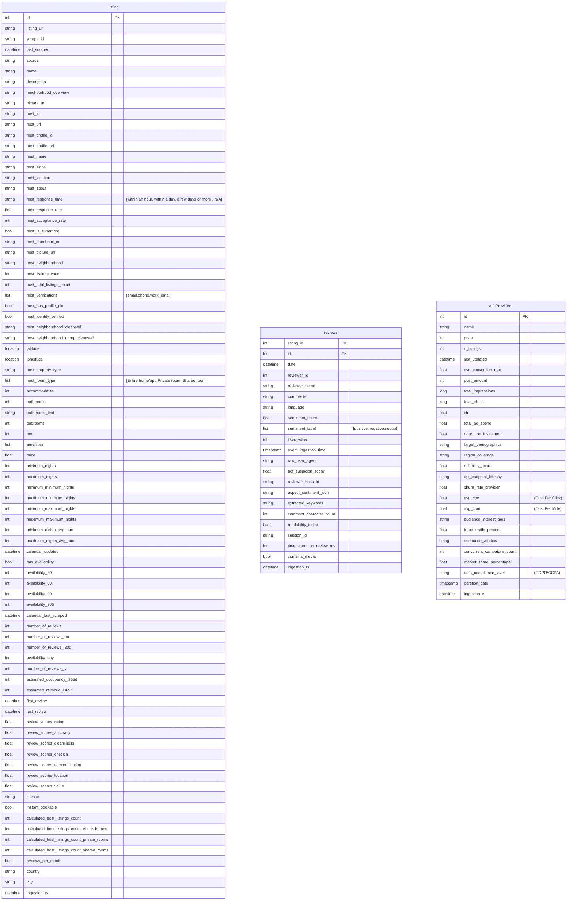

# Documentation airbnb Bigdata

  
Table of Contents

  <ol>
    <li>
        <a href="#about-the-project">About The Project</a>
    </li>
    <li>
        <a href="#architecture-diagrams">Architecture diagrams</a>
    </li>
    <li>
        <a href="#data-model-documentation">Data model documentation</a>
        <ul>
            <li>
                <a href="#bronze-architecture">Bronze Architecture</a>
            </li>
            <li>
                <a href="#silver-architecture">Silver Architecture</a>
            </li>
            <li>
                <a href="#gold-architecture">Gold Architecture</a>
            </li>
        </ul>
    </li>
    <li>
        <a href="#data-quality">Data Quality</a>
    </li>
  </ol>

<!-- ABOUT THE PROJECT -->
## About the project
This project implements a complete end-to-end Data Engineering pipeline for processing Airbnb datasets using modern big data technologies.
our project convey business problem: 

1. Business Question: What cities are best invest promoting in?
2. Business Question: Which promotion strategy is the best?

<!-- ARCHITECTURE DIAGRAMS -->
## Architecture diagrams
The pipeline supports both batch and streaming data ingestion.
Raw data such as listings,reviews and adsprovider are stored in the Bronze layer,
each in specific way such as:
* listings - from inside airbnb data source - additional data mart
* review - from inside airbnb - streaming data source
* adsprovider - generated by us - late arrival data source

The data is then cleaned, validated, and transformed into the Silver layer before being aggregated into analytical Gold tables that are optimized for reporting and business intelligence.

```mermaid
flowchart LR
    %% class definitions
    classDef source fill:#2C3E50,stroke:#1A252F,stroke-width:2px,color:#FFFFFF,font-weight:bold;
    classDef bronze fill:#CD7F32,stroke:#8B4513,stroke-width:2px,color:#FFFFFF,font-weight:bold;
    classDef silver fill:#E0E0E0,stroke:#9E9E9E,stroke-width:2px,color:#000000,font-weight:bold;
    classDef gold fill:#FFD700,stroke:#DAA520,stroke-width:2px,color:#000000,font-weight:bold;

    %% source nodes
    late([Late Arrivals - Ads Data]):::source
    stream([Streaming - Reviews Data]):::source
    additional([Batch Data - Listings Data]):::source

    %% bronze layer
    raw[<h2>BRONZE LAYER</h2><br/>Raw Data Ingestion<br/>• listing<br/>• reviews<br/>• adsProviders]:::bronze

    %% silver layer
    silver[<h2>SILVER LAYER</h2><br/>• Cleaned & Enriched<br/>• Cleaned Reviews</br></br>
    <u>Tables:</u></br>
    HostDetails</br>RentDetails</br>Location</br>Review</br>Metadata</br>providerDetails<br>providerMetrics</br>]:::silver
    
    %% consolidated gold layer as a single subgraph
    subgraph Gold_Layer[<h1 style="color: white;">GOLD LAYER</h1>]
        %% set internal layout
        direction TB
        
        %% styling the subgraph boundary
        style Gold_Layer fill:#FFD70033,stroke:#DAA520,stroke-width:3px,color:#000;
        
        %% facts & dimensions node
        fact[<u>Dimensions & Facts</u><br/><u>Facts Tables</u>:<br/>factListing<br/>factReview<br/>factAd<br/><u>
        Dim Tables</u>:<br/>dimLocation<br/>dimHost<br/>dimProperty<br/>dimReviewer<br/>dimProvider]:::gold

        %% aggregated tables node
        agg[<u>Aggregated Tables:</u><br/>AggNeighbourhoodInvest</br>AggAds</br>AggNeighborhoodPerformance</br>AggHostEconomics]:::gold
        
        %% machine learning table node
        ml[<u>ML Table:</u><br/>ml_feature_premium_pricing]:::gold
    end

    %% connections to bronze layer
    late -->|Up to 48h delay| raw
    stream -->|Real-time| raw
    additional -->|Nightly batch| raw
    
    %% connections to silver layer
    raw -->|Standardization<br/>| silver
    

    silver -->|pre-aggregate <br/>| Gold_Layer
```

<!-- DATA MODEL DOCUMENTATION -->
## Data model documentation
<!-- BRONZE ARCHITECTURE -->
### bronze architecture
The Bronze layer stores the raw Airbnb data exactly as it is received from the source, with minimal processing.

##
<!-- SILVER ARCHITECTURE -->
### silver architecture

```mermaid

erDiagram
    HostDetails{
        int id PK
        string host_id
        int listing_id FK

        string host_url
        string host_profile_id
        string host_profile_url
        string host_name
        string host_thumbnail_url
        string host_neighbourhood 
        int host_total_listings_count

        string host_location 
        string host_about
        bool host_is_superhost
        string host_picture_url
        list host_verifications "[email,phone,work_email]"
        bool host_has_profile_pic 
        bool host_identity_verified
        string property_type
        list room_type "[Entire home/apt, Private room ,Shared room]" 

        datetime ingestion_ts
    }
    
    HostMetrics{
        int id PK "(FK listing_id from hostDetails)"

        list host_response_time "[within an hour, within a day, a few days or more , N/A]"
        float host_response_rate 
        int host_acceptance_rate

        datetime ingestion_ts
    }

    RentDetails{
        int id PK "(FK listing_id from hostDetails)"

        int accommodates
        int bathrooms
        string bathrooms_text
        int bedrooms
        int beds
        list amenities
        int minimum_nights
        int maximum_nights
        int minimum_minimum_nights
        int maximum_minimum_nights
        int minimum_maximum_nights
        int maximum_maximum_nights
        int minimum_nights_avg_ntm
        int maximum_nights_avg_ntm
        string license

        datetime ingestion_ts
    }

    RentMetrics{
        int id PK "(FK listing_id from hostDetails)"
        
        float price_per_night

        bool has_availability
        int estimated_occupancy_l365d
        int estimated_revenue_l365d
        int availability_30
        int availability_60
        int availability_90
        int availability_365 
        int availability_eoy
        bool instant_bookable
        int calculated_host_listings_count
        int calculated_host_listings_count_entire_homes
        int calculated_host_listings_count_private_rooms
        int calculated_host_listings_count_shared_rooms
        int number_of_reviews_ltm
        
        datetime ingestion_ts
    }

    Location{
        int id PK "(FK listing_id from hostDetails)"
        
        string country
        string city
        
        string listing_url
        string name
        string description
        string neighbourhood
        string neighborhood_overview
        string picture_url
        location latitude
        location longitude
        string host_neighbourhood 

        datetime ingestion_ts
    }

    Review{
        long id PK "review_id"
        long listing_id FK "listing.id"

        datetime date
        datetime start_date
        datetime end_date
        bool is_current

        long reviewer_id
        string reviewer_name
        string comment
        string language
        float sentiment_score
        list sentiment_label "[positive,negative,neutral]"
        int likes_count

        datetime ingestion_ts
    }

    Metadata {
        int id PK
        
        string source
        string scrape_id
        datetime last_scraped
        datetime calendar_last_scraped

        datetime ingestion_ts
    }

    providerDetails{
        int id PK
        
        string name

        datetime ingestion_ts
    }

    providerMetrics{
        int id PK "FK from providerDetails"
        
        float avg_conversion_rate
        int post_amount
        long total_impressions
        long total_clicks
        float ctr
        float total_ad_spend
        float return_on_investment
        string region_coverage

        float churn_rate
        float avg_cpc "(Cost Per Click)"
        float avg_cpm "(Cost Per Mille)"

        int campaigns_count
        string data_compliance_level "(GDPR/CCPA)"
        datetime partition_date 

        datetime ingestion_ts
    }
```

##
<!-- GOLD ARCHITECTURE -->
### gold architecture
The model is built in an extended Star Schema configuration, strictly maintaining a Separation of Concerns between fact tables and dimension tables.

our reasoning for picking type 0 its a static information that does not need to change.

        1. dimLocation

our reasoning for picking type 2 for these dimension tables , we want to save its history with overwriting its data.

        1. dimHost
        2. dimProperty
        3. dimProvider

```mermaid

erDiagram
    %% Business Question: What cities are best invest promoting in?
    %% Business Question: Which promotion strategy is the best?
    
     factListing ||--|| dimLocation : "type 0"
     factListing }o--|| dimHost: "type 2"
     factListing ||--|| dimProperty: "type 2"
     factReview }o--|| dimHost: "type 2"
     factReview ||--|| dimLocation : "type 0"
     factReview ||--|| dimProperty: "type 2"
     factAd ||--|| dimProvider: "type 2"
     
    
    
    factListing{
      int id
      int property_key FK
      int location_key FK
      int host_key FK
      
      int total_listing_count
      float price_per_night
      int estimated_occupancy_l365d
      int estimated_revenue_l365d
      float host_response_rate 
      int host_acceptance_rate

      datetime ingestion_ts
    }
    
    dimProperty{
      datetime start_date
      datetime end_date
      bool is_current
      int property_key
      list room_type
      string property_type
      int bedrooms
      int beds
      list ameneties
      int accommodates

      datetime ingestion_ts
    }
    
    dimLocation{
      int location_key PK

      string neighbourhood
      location latitude
      location longitude
      string host_neighbourhood 

      string country
      string city

      datetime ingestion_ts
    }
    
    dimHost {
      int host_key PK
      
      datetime start_date
      datetime end_date
      bool is_current
      string name
      string response_time_category

      datetime ingestion_ts
    }
    
    factReview{
      int reviewer_key FK
      int property_key FK
      int location_key FK
      int host_key FK
     
      string comment
      string language
      int like_count 
      float sentiment_score
      int number_of_reviews_ltm

      datetime ingestion_ts
    }
    
    dimProvider{
      int provider_key
      
      datetime start_date
      datetime end_date
      bool is_current
      string name

      datetime ingestion_ts
    }
    
    factAd{
      int provider_key FK
      
      float avg_conversion_rate
      int post_amount
      long total_impressions
      long total_clicks
      float ctr
      float total_ad_spend
      float return_on_investment
      string region_coverage

      float churn_rate
      float avg_cpc "(Cost Per Click)"
      float avg_cpm "(Cost Per Mille)"

      int campaigns_count
      string data_compliance_level "(GDPR/CCPA)"
      datetime partition_date 

      datetime ingestion_ts
    }

    AggNeighbourhoodInvest{
        string city_name 
        string neighbourhood_name
        int neighbourhood_most_views
        int neighbourhood_most_bookings "est_revenue_365 / price_per_night"
        int neighbourhood_highest_reviews
        list neighbourhood_needed_boost
        float avg_order_price
        float avg_revenue_l365d
        float median_availability
        float avg_response_rate

        date ingestion_ts
    }
    
    AggAds{
        int provider_id PK
        string provider_name

        float provider_conversion_rate
        float most_clicked_provider
        int post_amount
        float avg_campaign_conversion
        float avg_campaign_cost
        int customer_gained
        float conversion_rate
        int new_customers_l30d_pct 

        datetime ingestion_ts
    }


    AggNeighborhoodPerformance {
        string neighbourhood PK "Grouped by dimLocation.neighbourhood"
        
        int total_active_listings "COUNT(factListing.id)"
        float avg_price_per_night "AVG(fact_airbnb.price)"
        float avg_annual_revenue "AVG(factListing.estimated_revenue_l365d)"
        float avg_occupancy_rate "AVG(factListing.estimated_occupancy_l365d)"
        int total_reviews_ltm "SUM(factReview.number_of_reviews_ltm) - indicates current hype"

        datetime ingestion_ts
    }

    AggHostEconomics {
        string room_type PK 
        
        int total_listings "COUNT(factListing.id)"
        float avg_price_per_night "AVG(factListing.price)"
        float avg_annual_revenue "AVG(factListing.estimated_revenue_l365d)"
        float avg_acceptance_rate "AVG(factListing.host_acceptance_rate)"
        float avg_response_rate "AVG(factListing.host_response_rate)"

        datetime ingestion_ts
    }

    %% MACHINE LEARNING REQUIREMENTS
    %% 1. Business Problem: Predict if a listing can command a "Premium Price" (Top 20% in its neighborhood) based on property features, availability, and host reputation.
    %% 2. Feature Table: ml_feature_premium_pricing

    ml_feature_premium_pricing {
        int listing_key FK 
        int property_key FK 
        int location_key FK 
        int host_key FK 
        
        %% Features (X)
        string property_type "From dimProperty"
        int accommodates "From dimProperty"
        int bedrooms "From dimProperty"
        int amenities_count "Derived: Count of items in dimProperty.amenities"
        int availability_30 "From factListing"
        float host_acceptance_rate "From factListing"
        string response_time_category "From dimHost"
        
        %% Target Variable / Label (Y)
        bool is_premium_target "Label: 1 if price > 80th percentile of location, else 0"

        datetime ingestion_ts
    }
```

<!-- COMPONENT DESCRIPTIONS-->
## Component descriptions

Our project is orchestrated using isolated Docker Compose environments communicating over a shared `iceberg_net` bridge network. 

*   **Data Storage & Table Format:** 
    *   **MinIO:** Acts as the S3-compatible storage layer (configured at `http://minio:9000` with the `warehouse.minio` alias).
    *   **Apache Iceberg:** Managed via a REST Catalog (`apache/iceberg-rest-fixture`) using the `S3FileIO` implementation pointing to the MinIO warehouse.
*   **Processing:** 
    *   **Apache Spark:** Runs via the `tabulario/spark-iceberg` container. It handles the processing logic and connects directly to Kafka and the Iceberg REST catalog.
*   **Streaming:** 
    *   **Apache Kafka:** Acts as the broker for real-time data streaming. The environment is configured with a dedicated setup container that automatically initializes the `airbnb_reviews` topic.
    *   **Schema Registry & AVRO:** Confluent Schema Registry is deployed to manage and enforce AVRO schemas for message serialization. Integrating robust serialization classes at the source guarantees a strict data contract, ensuring structural stability as data is mapped from the Bronze layer all the way through to Gold.
*   **Orchestration:** 
    *   **Apache Airflow:** Deployed with Webserver, Scheduler, and Triggerer containers. It utilizes a `LocalExecutor` and is backed by a PostgreSQL (`postgres:13`) metadata database. Airflow is configured with active connections to the Spark cluster and the Kafka broker for task scheduling and sensing.

<!-- DATA QUALITY -->
## Data Quality
**Real-time Streaming Validation (AVRO):**
Data ingested via Kafka is strictly validated against pre-defined AVRO schemas using Confluent Schema Registry. By enforcing strict serialization rules before ingestion, this acts as our first line of defense against malformed messages.

**General Guideline (Schema Validation):**
At the end of every pipeline, all column types are strictly checked and cast according to the predefined Schema file.

---

## 1. Pipeline: `reviews_to_silver`
Handles reviews data, focusing on filling missing values to ensure continuous sentiment analysis.

| Column | Default Value / Action if Missing or Null |
| :--- | :--- |
| `reviewer_id` | **Drop row** (Remove completely) |
| `date` | Fallback to `event_ingestion_time` ➔ If still Null, fallback to `current_timestamp` |
| `listing_id` | `-1` |
| `sentiment_label` | `"positive"` |
| `sentiment_score` | `0` (for Null/NaN) |
| `reviewer_name` | `""` (Empty string) |
| `language` | `"unknown"` |
| `likes_count` | `0` |
| `ingestion_ts` | Set to current timestamp |

---

## 2. Pipeline: `late_arrival_to_silver`
Handles delayed Ad performance data, zeroing out metrics when campaign data is missing.

| Column | Default Value / Action if Missing or Null |
| :--- | :--- |
| `id` | **Drop row** (Remove completely) |
| `name` | `""` (Empty string; also for token values like `null`/`nan`) |
| `avg_conversion_rate` | `0` |
| `post_amount` | `0` |
| `total_impressions` | `0` |
| `total_clicks` | `0` |
| `ctr` | `0` |
| `return_on_investment`| `0` |
| `avg_cpc` | `0` |
| `avg_cpm` | `0` |
| `campaigns_count` | `0` |
| `region_coverage` | `"unkown"` |
| `data_compliance_level`| `"unkown"` |
| `partition_date` | Fallback to `last_updated` ➔ If still Null, fallback to `current_timestamp` |
| `ingestion_ts` | Set to current timestamp |

---

## 3. Pipeline: `listing_to_silver`
Handles property listings, including column renaming, missing value fallbacks, and setting up the infrastructure for SCD Type 2.

### A. Column Renaming
*   `id` ➔ `listing_id`
*   `host_id` ➔ `host_profile_id`
*   `host_url` ➔ `host_profile_url`
*   `price` ➔ `price_per_night`
*   `comments` ➔ `comment`
*   `like_votes` ➔ `likes_count`

### B. Handling Missing Values

| Column | Default Value / Action if Missing or Null |
| :--- | :--- |
| `id` (Before rename) | **Drop row** (Remove completely if None/Null) |
| `host_name` | `""` (Empty string, including token values like `nan`/`null`) |
| `host_response_time` | `"unknown"` |
| `room_type` | `"unkown"` |
| `property_type` | `"unkown"` |
| `neighbourhood` | `"unkown"` |
| `host_neighbourhood` | `"unkown"` |
| `price_per_night` | `0` |
| `estimated_revenue_l365d`| `0` |
| `estimated_occupancy_l365d`| `0` |
| `number_of_reviews_ltm` | `0` |
| `bedrooms` | `0` |
| `beds` | `0` |
| `amenities` | `[]` |

### C. SCD Type 2 Logic Preparation
*   **`start_date`:** Add this column using `date` as the default value.
*   **`end_date`:** Add this column, retrieving the value from the `start_date` of the *next* row (Lead function).

---

## 4. Pipeline: `silver_to_gold`
Business-layer quality rules applied while generating Gold tables.

| Gold Table / Column | Default Value / Action |
| :--- | :--- |
| `dimProvider.provider_key` | **Drop row** when `provider_key` is Null |
| `AggNeighbourhoodInvest.neighbourhood_needed_boost` | Derived from `avg_revenue_l365d`: `> 20000` ➔ `["low"]`, else `["high"]` |
| `AggAds.provider_name` | Uses already-cleaned `providerDetails.name` from Silver (no extra fallback in Gold) |
| `dimHost.end_date`, `dimProperty.end_date`, `dimProvider.end_date` | Null is expected for current SCD rows |
| `factReview` review score columns | Removed from Gold schema/output (`review_scores_rating`, `review_scores_accuracy`, `review_scores_cleanliness`) |
| `AggNeighborhoodPerformance.avg_review_score` | Removed from Gold schema/output |
| `AggNeighbourhoodInvest.avg_review_score` | Removed from Gold schema/output |
